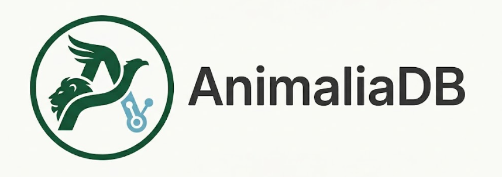
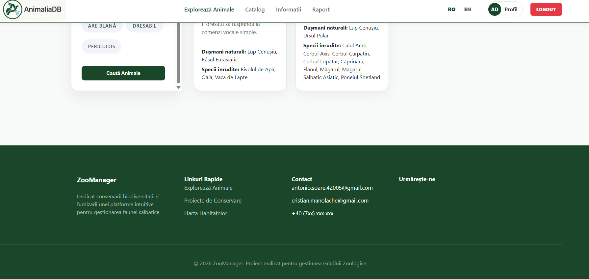
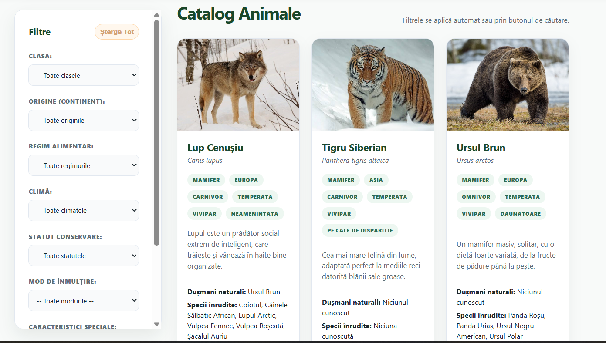
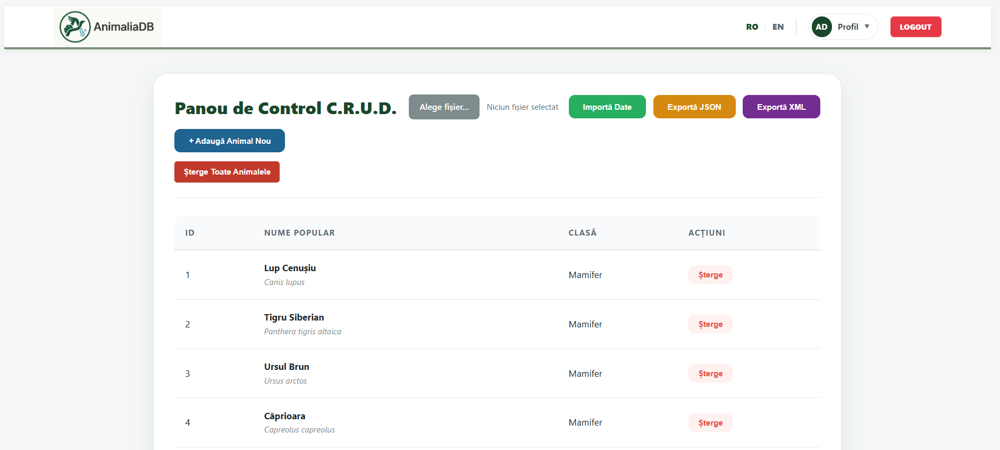
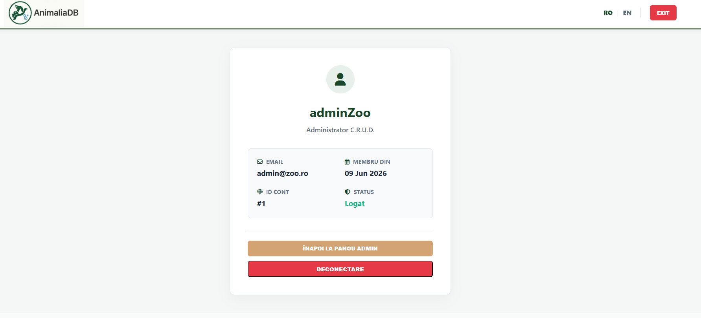
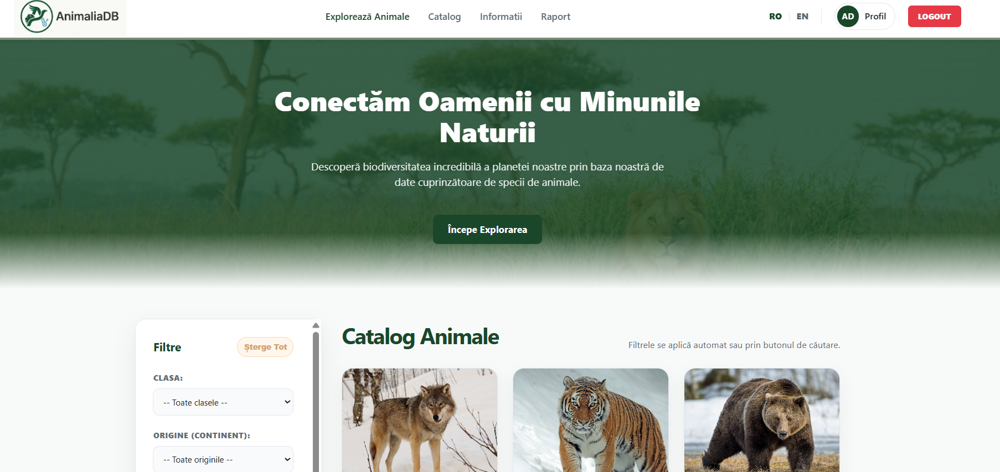
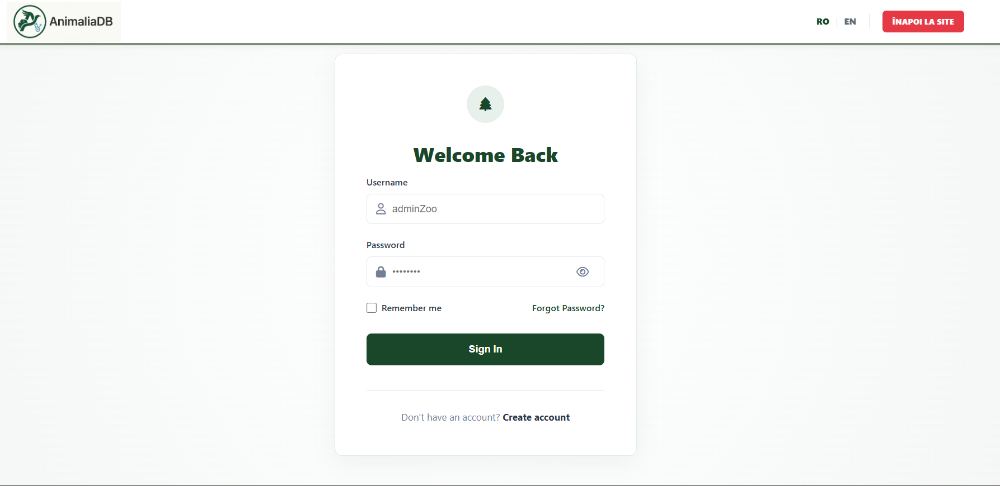
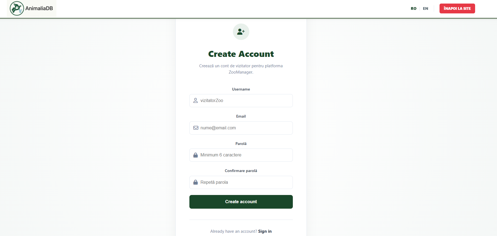
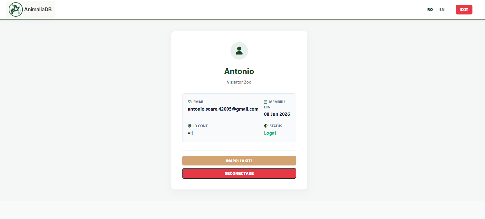

<div align="center">
  
  <h1>AnimaliaDB - Catalog Animale Web</h1>
  
  <p>
    O aplicație Web interactivă și responsive pentru gestionarea, filtrarea avansată și explorarea unui catalog complex de specii de animale.
  </p>

<p>
  <a href="https://github.com/SoareAntonio/Proiect_Web/graphs/contributors?from=3%2F7%2F2026">
    
  </a>
  <a href="https://github.com/SoareAntonio/Proiect_Web/commits/main/">
    
  </a>
  <a href="https://github.com/SoareAntonio/Proiect_Web/forks">
    
  </a>
  <a href="https://github.com/SoareAntonio/Proiect_Web/stargazers">
    
  </a>
  <a href="https://github.com/SoareAntonio/Proiect_Web/issues">
    
  </a>
  <a href="https://github.com/utilizator/Proiect_Web/blob/master/LICENSE">
    
  </a>
</p>
   
<h4>
    <a href="./doc/demo.mp4">Vizualizează Demo Video</a>
  <span> · </span>
    <a href="[./doc/scholarly.html](http://localhost/Proiect_Web/frontend/scholarly.html)">Raport Scholarly HTML</a>
  <span> · </span>
    <a href="https://github.com/SoareAntonio/Proiect_Web/issues">Raportează Bug</a>
  <span> · </span>
    <a href="https://github.com/SoareAntonio/Proiect_Web/issues">Cere Funcționalitate</a>
  </h4>
</div>

<br />

# :notebook_with_decorative_cover: Cuprins

- [:notebook\_with\_decorative\_cover: Cuprins](#notebook_with_decorative_cover-cuprins)
  - [:star2: Despre Proiect](#star2-despre-proiect)
    - [:dart: Funcționalități esențiale](#dart-funcționalități-esențiale)
    - [:camera: Capturi de Ecran](#camera-capturi-de-ecran)
    - [:space\_invader: Tehnologii Folosite](#space_invader-tehnologii-folosite)
      - [Client (Frontend):](#client-frontend)
      - [Server (Backend - XAMPP):](#server-backend---xampp)
      - [Bază de Date (Oracle):](#bază-de-date-oracle)
    - [:art: Referință Culori Interfață](#art-referință-culori-interfață)
  - [:toolbox: Ghid de Pornire](#toolbox-ghid-de-pornire)
    - [:bangbang: Cerințe Preliminare](#bangbang-cerințe-preliminare)
    - [:key: Configurare Mediu](#key-configurare-mediu)
    - [:running: Rulare Locală](#running-rulare-locală)
    - [:triangular\_flag\_on\_post: Deployment](#triangular_flag_on_post-deployment)
  - [:compass: Etapele Dezvoltării (Roadmap)](#compass-etapele-dezvoltării-roadmap)
  - [:wave: Contribuitori](#wave-contribuitori)
  - [:warning: Licență](#warning-licență)
  - [:handshake: Contact](#handshake-contact)
  - [:gem: Bibliografie și Resurse](#gem-bibliografie-și-resurse)

---

## :star2: Despre Proiect

### :dart: Funcționalități esențiale

- **Filtrare Avansată Multi-Criteriu (Fără reîncărcarea paginii):**
  - Selectare după proprietăți taxonomice și fiziologice: Clasă, Origine geografică, Regim alimentar, Climă.
  - Filtre speciale nou introduse: **Statut de conservare** (ex: Pe cale de dispariție) și **Mod de înmulțire** (Vivipar/Ovipar).
  - Comutatoare binare rapide: prezența blănii, dresabilitate și nivel de pericol.

- **Sistem Inteligent de Relații între Specii (Oracle Subqueries):**
  - Extragere corelată dinamică din tabelele asociative pentru afișarea pe carduri a **Dușmanilor naturali** și a **Speciilor înrudite** folosind optimizări SQL (`LISTAGG` și interogări bazate pe `UNION`).

- **Sistem de Management Bilingv (RO / EN):**
  - Interfața structurală rămâne optimizată în română, dar descrierile animalelor de pe carduri se pot comuta instantaneu în limba engleză direct din bara de navigare, folosind mapări dinamice în memorie.

- **Sistem Robust de Backup și Sincronizare (Import/Export):**
  - Export instantaneu al întregii baze de date în formate **JSON** și **XML** .
  - Import securizat cu mecanism de tip "Tranzacție" ce curăță datele vechi și **resetează complet secvențele bazei de date de la 1** (`DROP` / `CREATE SEQUENCE`).

---

### :camera: Capturi de Ecran

<div style="display: grid; grid-template-columns: 1fr 1fr; justify-content: center; gap: 20px;">
  
  
  
  
  
  
  
  
</div>

---

### :space_invader: Tehnologii Folosite

#### Client (Frontend):

[](./frontend/index.html)
[](./frontend/assets/css/layout.css)
[](./frontend/app.js)

#### Server (Backend - XAMPP):

[](./backend/index.php)

#### Bază de Date (Oracle):

[](./backend/config/creare_tabele.sql)

---

### :art: Referință Culori Interfață

| Nume Element | Hex | Culoare |
| :--- | :---: | :---: |
| Culoare Principală (Butoane, Accente) | `#1a472a` |  |
| Culoare Secundară (Fundal Filtre) | `#d4a373` |  |
| Culoare Fundal Pagină | `#f8faf9` |  |
| Etichete & Elemente de Status | `#1b262c` |  |

---

## :toolbox: Ghid de Pornire

### :bangbang: Cerințe Preliminare

- Server Apache local (recomandat prin **XAMPP**).
- **Oracle Database** (XE 11g, 18c sau 21c).
- Extensia PHP `oci8` activată în fișierul `php.ini` din XAMPP pentru a permite conexiunea nativă cu baza de date Oracle.

---

### :key: Configurare Mediu

În folderul `backend/config/Database.php`, configurează credențialele de conectare pentru utilizatorul bazei de date:

```php
$username = 'zoo_admin';
$password = 'parola_ta';
$connection_string = 'localhost/XE';
```

---

### :running: Rulare Locală

1. **Clonează repository-ul** în folderul serverului tău web (ex: `htdocs` pentru XAMPP):

   ```bash
   git clone https://github.com/SoareAntonio/Proiect_Web.git
   cd Proiect_Web
   ```

2. **Inițializează Baza de Date Oracle:**

   - Autentifică-te ca `SYS` (sau un cont cu drepturi de administrator) și creează utilizatorul rulând sys.sql cu prima parte din instrucțiunile SQL (creare `zoo_admin`).

   - Autentifică-te cu noul utilizator (`zoo_admin`) și rulează scriptul principal:

     ```sql
     @database/creare_tabele.sql
     ```

   - Rulează scriptul de nomenclatoare pentru a popula categoriile:

     ```sql
     @database/insert.sql
     ```

3. **Pornește serverul:**

   - Deschide panoul de control XAMPP și asigură-te că serviciul **Apache** rulează.
   - Accesează aplicația în browser la adresa:
     ```
     http://localhost/Proiect_Web/frontend/index.html
     ```

4. **Importul de date** *(Opțional, dar recomandat):*
   - Logheaza te cu adminZoo si parola
   - Intră în secțiunea de **Admin Dashboard**.
   - Folosește funcția **"Import JSON"** și selectează fișierul de date furnizat în proiect pentru a popula instantaneu catalogul cu **119 specii** .
   - Rulează scriptul pentru a pupula specii inrudite si dusamani naturali:
  
    ```sql
     @database/relatii.sql
     ```
     Daca intampini probleme poti rula scriptul:
      ```sql
     @database/drop_tabele.sql
     @database/curatare_tabele.sql
     ```


---

### :triangular_flag_on_post: Deployment

Aplicația este construită pe o arhitectură decuplată logic. Pentru deployment pe un server de producție:

1. Mută conținutul folderului `/frontend` pe orice server web capabil să livreze fișiere statice (HTML/CSS/JS).
2. Configurează un server capabil să ruleze **PHP 8+** și care dispune de driverele **OCI8** pentru folderul `/backend`.
3. Actualizează constanta `API_URL` din fișierul `app.js` cu noul domeniu public al serverului tău backend.

---

## :compass: Etapele Dezvoltării (Roadmap)

- [x] Stabilirea cerințelor și design-ul arhitecturii (Diagrame C4).
- [x] Crearea schemei relaționale Oracle (Generare secvențe, foreign keys, constraints).
- [x] Dezvoltarea interfeței web responsive (HTML5, CSS3 Variables).
- [x] Implementarea logicii de filtrare dinamică (JavaScript Fetch API).
- [x] Crearea controlerelor PHP (Arhitectură MVC).
- [x] Optimizarea subinterogărilor SQL pentru relații (`LISTAGG`).
- [x] Securizarea panoului de administrare (Autentificare bazată pe token).
- [x] Dezvoltarea modulului robust de Import/Export XML și JSON.
- [x] Finalizarea documentației Scholarly HTML și a materialelor de prezentare.

---

## :wave: Contribuitori

Echipa de dezvoltare a proiectului:

- **Numele Tău** ([@LinkedIn](https://www.linkedin.com/)) — Responsabil Frontend, Backend,Baza de date.
- **Numele Colegului Tău** ([@LinkedIn](https://www.linkedin.com/)) — Responsabil Frontend, Backend,Baza de date.

Contribuțiile externe sunt binevenite! Dacă dorești să îmbunătățești aplicația, te rugăm să deschizi un **Issue** sau să trimiți un **Pull Request**.

---

## :warning: Licență

Acest proiect este distribuit sub licența **MIT**. Vezi fișierul `LICENSE` pentru detalii. Toate imaginile și textele utilizate (datele de test) sunt folosite în scop educațional și intră sub incidența Creative Commons.

---

## :handshake: Contact

- **Numele Tău:** [antonio.soare.42005@gmail.com](mailto:antonio.soare.42005@gmail.com)
- **Numele Colegului Tău:** [manolachescristian06@gmail.com](mailto:manolachescristian06@gmail.com)
- **Link Proiect:** [https://github.com/SoareAntonio/Proiect_Web](https://github.com/SoareAntonio/Proiect_Web)

---

## :gem: Bibliografie și Resurse

Mulțumiri speciale și resurse folosite pe parcursul dezvoltării:

- [Facultatea de Informatică Iași (FII UAIC)](https://www.info.uaic.ro/) — Cursurile de Tehnologii Web și Baze de Date.
- [MDN Web Docs](https://developer.mozilla.org/en-US/) — Referința principală pentru JavaScript și CSS.
- [PHP OCI8 Documentation](https://www.php.net/manual/en/book.oci8.php) — Modulul de comunicare cu baza de date Oracle.
- [Shields.io](https://shields.io/) — Pentru generarea badge-urilor SVG.
- [Awesome README Template](https://github.com/Louis3797/awesome-readme-template) — Pentru șablonul inițial de README.